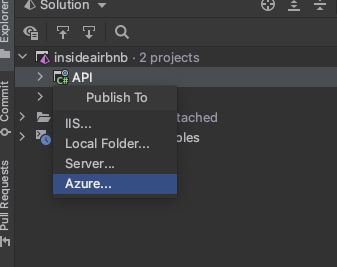
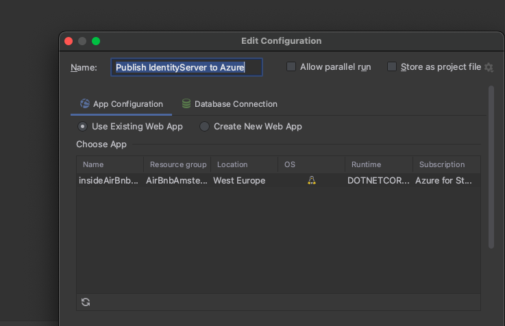

# Deploy-your-.Net-API-to-Azure-From-Rider
How to host your Api project to Azure using Rider
- After creating your web app via your Azure account, the first thing you need to do is to sign-in into your Rider Azure account from Rider.
- For Creating your web app watch the Tim Cory tutorial. everyhing is easy to follow. stop the video by editing the configuration for VS (https://www.youtube.com/watch?v=DUfPaY6FRII).
# Signing in in Rider: 
1. from the Azure explorer hit the sign-in button. Make sure to give it a time untill all the services and resources uploaded into the explorer. sometimes it needs to hit the refresh button to make sure that the connection was good established

2. from your explorer Right-click -> Publich -> Azure. (if you dont see the Azure Option, then you need to refresh your Azure Explorer) Otherwise try Create new
 
 
 
 3. It is up to you if you want to select the Web app that you have Already created, or to create a new one. You can from this window also Check your Database Connection. the connection string should match your application connection string
 
 

# Problems with connecting to your SQL Azure from Web app.
1. On Azure: Go to the Database Server -> FireWall -> Allow services to use the database -> give it a new Role and the new IP Address that you need to give it the permisson.
